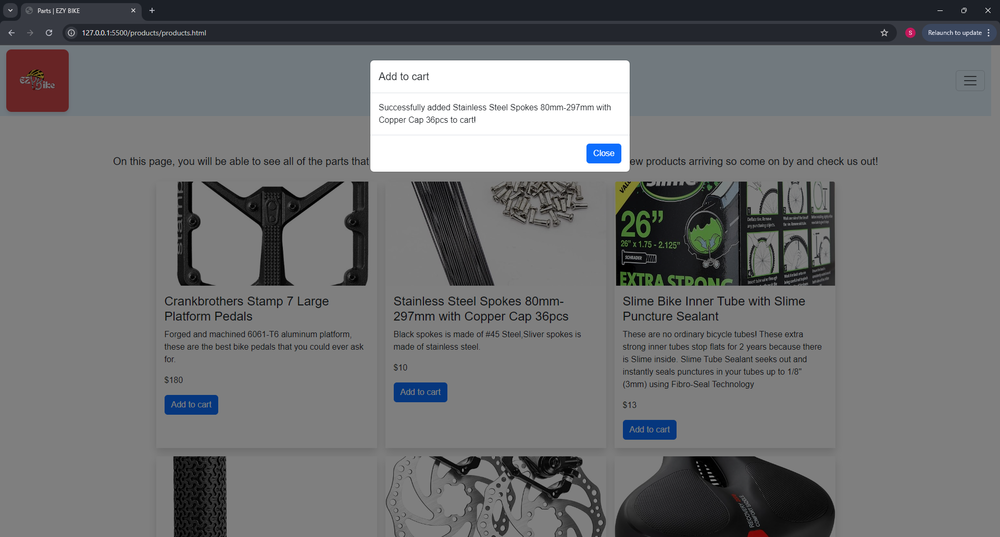

# Project-1- EZY BIKE

## Content:
The content of the following reposiory is the summation of efforts from our group, comprising of Catherine, Marquel, OG, and myself.
We started with our idea to create an online shop for a bike company, and ended up having a lot of fun and learning a lot along the way.
Each folder within the project contains multiple files pertaining to different parts of the page. We created a landing page that links with all the other pages, creating a usable website allowing for a user to create a cart full of products and go to checkout with them.
We hope that everyone enjoys our project demo and our project as much as we enjoyed creating it.

### Technologies used
For this project, we utilized HTML, Javascript, and CSS. We also used Bootstrap in our project.

### User Story
As a Bicyclist, I want to purchase bike-related products so that I can get the best gear and accessories at an affordable price.

### Wireframe
Below is a link to the wireframe that we used in the general guiding of our project
https://www.figma.com/proto/Rt4bygEQ5gMPoSOL5zZH6h/Untitled?node-id=1-2&m=dev&scaling=min-zoom&content-scaling=fixed&page-id=0%3A1

### Screenshots of results

### GitHub pages link
https://scottmsaller.github.io/Project-1/
